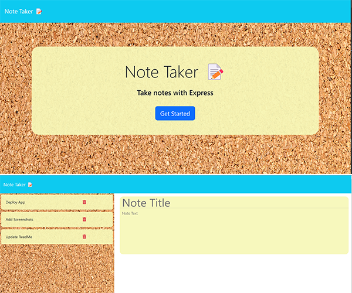

<a id="badges"></a>
[](https://opensource.org/licenses/MIT)


# Note Taker 📝

## Description
A simple app designed to Take, Save, and Delete notes using Express.js on the backend


## Table of Contents
1. [Usage](#usage)
2. [The App](#installation)
3. [Contributing](#contributing)
4. [Screenshot](#screenshot)
5. [License](#license)
6. [Tests](#tests)
7. [Links](#links)
8. [Questions](#support)

---

<a id="usage"></a>
## Usage
Go to the Deployed Link in the Links Section #7 in Table of Contents

<a id="installation"></a>
```
https://nodenotes-js-8e31ec34cd5f.herokuapp.com/
```

---

<a id="contributing"></a>
## Contributing
N/A


<a id="screenshot"></a>
## Screenshot


---


<a id="license"></a>
## License
[MIT](https://opensource.org/licenses/MIT)


<a id="tests"></a>
## Tests
None


<a id="links"></a>
## Links
### Repo Link:
 https://github.com/8BitGinger/noteTaker
### Deployed Link:
https://nodenotes-js-8e31ec34cd5f.herokuapp.com/
### Student Portfolio:
https://8bitginger.github.io/studentPortfolio/


<a id="support"></a>
## Questions
Reach out for Questions or Support here:
### Email: 
ryan.fann@gmail.com
#### GitHub Username: 
[8BitGinger](https://github.com/8BitGinger)

